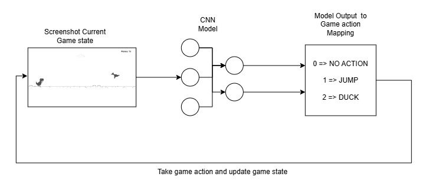
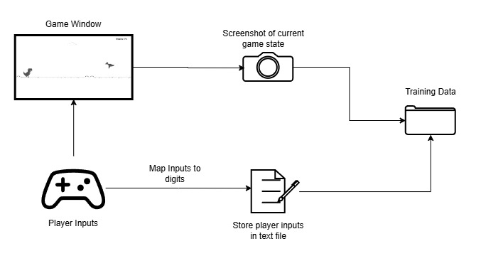

# Neural Network Plays Chrome Dinosaur 🦖

Made by [Ofei](www.google.com)

## Table of contents

- [Neural Network Plays Chrome Dinosaur 🦖](#neural-network-plays-chrome-dinosaur-)
  - [Table of contents](#table-of-contents)
  - [Description](#description)
  - [Installation](#installation)
  - [Methodology](#methodology)
    - [Data Collection](#data-collection)
  - [Controls](#controls)
  - [Libraries](#libraries)
  - [FAQ](#faq)


## Description

We train a CNN model to play the Chrome Dinosaur Game.

System Architecture of the project

 
## Installation

Requirements: You must have Python installed and preferably a code editor like PyCharm.

1. Clone the repository
2. In the terminal, navigate to the directory where the repository was cloned, e.g., `C:\Users\Max\PycharmProjects\chrome-dinosaur`
3. Create a virtual environment, activate it, and install pygame by running the following commands in the terminal:
   ```bash
   python -m venv venv #This creates a virtual environment
   venv\Scripts\activate #This activates the virtual environment
   pip install -r requirements.txt #This installs the Pygame library
   ```

## Methodology

### Data Collection



## Controls

- Use the up arrow key to jump.
- Press any key to start the game.
- When the game ends, press any key to restart.

## Libraries

- [pygame](https://www.pygame.org/news): Pygame is a cross-platform set of Python modules designed for writing video games.
- [pytorch](https://pytorch.org/): Pytorsh is a deep learning framework that accel

## FAQ

- How to Open GitHub Projects in PyCharm? [Explained Here](https://youtu.be/cAnWazo5pFU)
- How to use Virtual Environments? [Explained Here](https://youtu.be/2P30W3TN4nI)
- How to install PyCharm and Python? [Explained Here](https://youtu.be/XsL8JDkH-ec)
- How to set PyCharm Config. and Interpreter? [Explained Here](https://youtu.be/OajNS-WHiUI)


